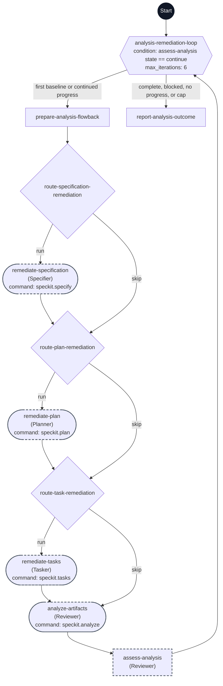

# Analyze and Remediate workflow flowchart

This diagram maps every step ID in [workflow.yml](./workflow.yml) to its execution path. Each node shows its exact step ID, its assigned agent in parentheses when present, and its command when present.

The dark Start circle marks workflow entry. Rectangles are `prompt` steps, diamonds are `switch` steps, the hexagon is the `do-while` step, and rounded nodes are command steps. A dashed outline marks `flow_kit.delegated: true`.

The first pass skips all correction stages and establishes a fresh analysis baseline. Later passes enter the shared waterfall at the highest affected artifact: specification → plan → tasks, plan → tasks, or tasks only. Every path reaches the same analyzer and assessment. The first baseline may continue without resolved findings; every correction pass requires verified resolution of a prior finding. Six total passes allow one baseline and at most five corrections. Missing evidence, invalid stage actions, failed commands, blockers, or required operator decisions stop before further mutation and are reported in the main task. Implementation remains separately invoked.
