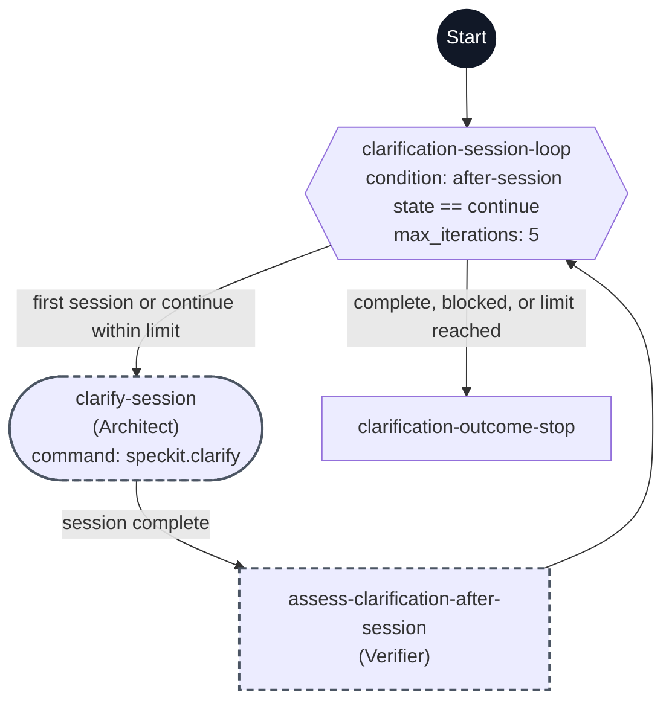

# Clarify workflow flowchart

This diagram maps the step IDs in [workflow.yml](./workflow.yml) to their execution paths. Each node shows its step ID and, when assigned, the agent name in parentheses or a command. Steps without an agent assignment remain in the main task.

The dark Start circle marks workflow entry. Rectangles are `prompt` steps, the hexagon is the `do-while` step's end-of-body condition, and the rounded node is the command step. A dashed outline marks `flow_kit.delegated: true`. The five-question limit applies to each `speckit.clarify` session; the `do-while` step allows at most five sessions in one invocation.

The command session checks for significant ambiguity, asks substantive questions in the main task when needed, relays each operator answer to the same active child, and incorporates accepted answers incrementally. The post-session assessment controls whether another session starts. The first `continue` result requires evidence that the session resolved an ambiguity; later results must resolve a prior remaining ID. All terminal states use one outcome step, which reports the reason for stopping and preserves unresolved questions. Clarification does not invoke Plan or approve planning readiness.
