# Closeout workflow flowchart

This diagram maps all 34 step IDs in [workflow.yml](./workflow.yml). The dark Start circle marks entry; rectangles are prompts, diamonds are switches, the hexagon is the bounded loop, parallelograms are human gates, and rounded nodes are commands. Dashed outlines mark delegated steps. Approval display labels preserve the original human choices.

```mermaid
flowchart TD
    start((Start))
    n01["assess-closeout-readiness<br/>(Verifier)"]
    n02@{ shape: diam, label: "route-initial-closeout" }
    n03["prepare-closeout-status"]
    n04@{ shape: diam, label: "route-closeout-status" }
    n05(["mark-converged-specification-complete<br/>(Architect)<br/>command: speckit.specify"])
    n06{{"closeout-debrief-loop<br/>condition: assess-closeout-debrief state == continue<br/>max_iterations: 6"}}
    n07(["debrief-roadmap<br/>(Verifier)<br/>command: speckit.flow-roadmap.debrief"])
    n08["assess-closeout-debrief<br/>(Verifier)"]
    n09@{ shape: diam, label: "route-closeout-correction" }
    n10["prepare-closeout-flowback"]
    n11@{ shape: diam, label: "route-closeout-specification-remediation" }
    n12(["reconcile-closeout-specification<br/>(Architect)<br/>command: speckit.specify"])
    n13@{ shape: diam, label: "route-closeout-plan-remediation" }
    n14(["reconcile-closeout-plan<br/>(Architect)<br/>command: speckit.plan"])
    n15@{ shape: diam, label: "route-closeout-tasks-remediation" }
    n16(["reconcile-closeout-tasks<br/>(Architect)<br/>command: speckit.tasks"])
    n17(["analyze-closeout-artifacts<br/>(Verifier)<br/>command: speckit.analyze"])
    n18["assess-closeout-task-eligibility<br/>(Verifier)"]
    n19@{ shape: diam, label: "route-closeout-implementation" }
    n20(["implement-closeout-eligible-tasks<br/>(Builder)<br/>command: speckit.implement"])
    n21["prepare-roadmap-verification"]
    n22@{ shape: diam, label: "route-roadmap-verification" }
    n23[/"approve-roadmap-transition"/]
    n24@{ shape: diam, label: "route-roadmap-transition" }
    n25(["apply-approved-roadmap-verification<br/>command: speckit.flow-roadmap.write"])
    n26["prepare-wiki-maintenance<br/>(Verifier)"]
    n27@{ shape: diam, label: "route-wiki-maintenance" }
    n28{{"wiki-reconciliation-loop<br/>condition: assess-wiki-maintenance state == continue<br/>max_iterations: 5"}}
    n29["prepare-wiki-refresh"]
    n30(["ingest-curated-context<br/>(Builder)<br/>command: speckit.flow-wiki.ingest"])
    n31(["lint-wiki<br/>(Verifier)<br/>command: speckit.flow-wiki.lint"])
    n32["assess-wiki-maintenance<br/>(Verifier)"]
    n33["verify-closeout-readiness<br/>(Verifier)"]
    n34["report-closeout-outcome"]

    start --> n01
    n01 --> n02
    n02 -- continue --> n03
    n03 --> n04
    n04 -- run --> n05
    n05 --> n06
    n04 -- skip --> n06
    n06 -- first or next fresh check --> n07
    n07 --> n08
    n08 --> n09
    n09 -- continue --> n10
    n10 --> n11
    n11 -- run --> n12
    n12 --> n13
    n11 -- skip --> n13
    n13 -- run --> n14
    n14 --> n15
    n13 -- skip --> n15
    n15 -- run --> n16
    n16 --> n17
    n15 -- skip --> n17
    n17 --> n18
    n18 --> n19
    n19 -- continue --> n20
    n19 -- blocked --> n34
    n20 --> n06
    n19 -- complete --> n06
    n09 -- complete --> n06
    n09 -- blocked --> n06
    n06 -- complete / blocked / bounded stop --> n21
    n02 -- complete --> n21
    n02 -- blocked --> n21
    n21 --> n22
    n22 -- patch-ready --> n23
    n23 --> n24
    n24 -- approved --> n25
    n25 --> n26
    n24 -- not-approved --> n26
    n22 -- already-verified --> n26
    n22 -- blocked --> n26
    n26 --> n27
    n27 -- ready --> n28
    n28 -- first pass / continue within cap --> n29
    n29 --> n30
    n30 --> n31
    n31 --> n32
    n32 --> n28
    n28 -- complete / blocked / bounded stop --> n33
    n33 --> n34
    n27 -- blocked --> n34
    n08 -- controller no progress / cap --> n34
    n20 -- controller unresolved blocker --> n34

    classDef delegated stroke:#4b5563,stroke-width:2px,stroke-dasharray:6 4
    class n01,n05,n07,n08,n12,n14,n16,n17,n18,n20,n26,n30,n31,n32,n33 delegated
    style n02 stroke-dasharray:0
    style n04 stroke-dasharray:0
    style n09 stroke-dasharray:0
    style n11 stroke-dasharray:0
    style n13 stroke-dasharray:0
    style n15 stroke-dasharray:0
    style n19 stroke-dasharray:0
    style n22 stroke-dasharray:0
    style n24 stroke-dasharray:0
    style n27 stroke-dasharray:0
    style start fill:#111827,stroke:#111827,color:#ffffff
```

Initial readiness can stop without a loop output, or use current trusted already-verified evidence. Otherwise a clear Draft-to-Complete update precedes the fresh debrief loop. Every loop pass starts with debrief; the first assessment establishes a baseline, subsequent corrections require a resolved prior finding. Six checks allow five corrections plus a final confirmation. Only `continue` enters the shared specification → plan → tasks waterfall; fresh analysis precedes eligible implementation.

An eligibility `complete` result means no eligible implementation work and returns to a fresh debrief. `blocked` eligibility and unresolved implementation blockers stop directly at the shared report under the [controller protocol](../../controllers/flow-kit/controller-protocol.md), before another debrief. The controller checks progress, evidence, and the cap before entering corrections. Explicit controller stop edges show this declared runtime policy in addition to ordinary YAML branch joins; native CLI execution does not establish these controller guarantees.

Outcome preparation uses only completed initial or loop evidence. An exact verification patch requires human approval, then a fresh roadmap check. Returning or deferring preserves the original choice and skips maintenance. Newly verified and already-verified features both enter shared wiki ingestion and lint checks. Wiki maintenance has its own sibling five-pass loop: select one authorized source, ingest, lint, and assess. Continue only when a prior source-coverage or stale-claim gap is substantively resolved; do not treat timestamps or successful commands as progress. Stale pages map through citations to sources. Conflicting authority, age-only warnings, unavailable sources, unsupported repairs, scope expansion, no progress, and cap exhaustion block. Only the latest validated complete maintenance assessment permits a readiness recommendation. The final report presents verified commit readiness automatically; only the exact roadmap-patch gate requires human approval, and an actual commit requires a subsequent explicit operator request; this workflow never commits, integrates Git, invokes another workflow, or accepts the feature. Partial approved changes are preserved and reported when later steps fail.
