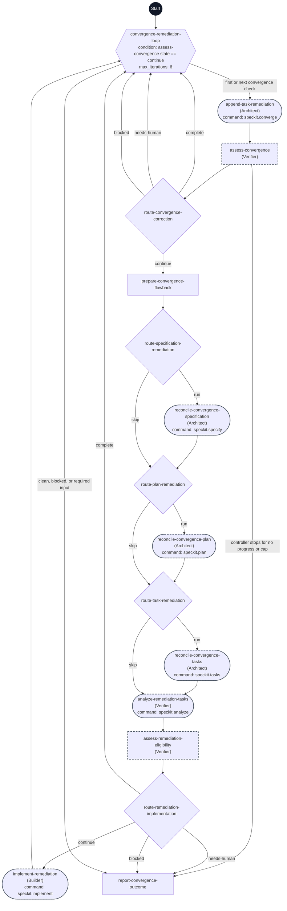

# Converge workflow flowchart

This diagram maps every step ID in [workflow.yml](./workflow.yml) to its execution path. Each node shows its exact step ID, assigned agent in parentheses when present, and command when present.

The dark Start circle marks workflow entry. Rectangles are prompt steps, diamonds are switch steps, the hexagon is the do-while loop, and rounded nodes are command steps. Dashed outlines mark delegated steps.

Every pass starts with `speckit.converge`. It checks current implementation and records remaining work under its append-only contract. The assessment classifies that fresh report and the controller checks progress and the correction limit before entering the waterfall. The first report establishes the gap baseline; subsequent reports must prove resolution of a prior gap.

Corrections enter the shared waterfall at specification, plan, or tasks as needed; implementation-only gaps skip all three stages. Fresh task analysis and eligibility verification precede implementation. Successful implementation returns directly to `speckit.converge`. Eligibility `complete` only means no eligible task work and still returns for fresh convergence; eligibility blockers or required operator decisions stop immediately through the outcome report. Failed commands, unresolved implementation blockers, invalid actions, and stale evidence also stop before further work.

Six total passes allow five corrections and a final convergence check. A clean sixth check succeeds; unresolved findings at that check stop before a sixth correction. Empty top-level branches reach loop exit without another command invocation. The controller stop edges show its declared routing policy in addition to YAML branch joins. One final report handles all outcomes; Close Out remains separately invoked.
