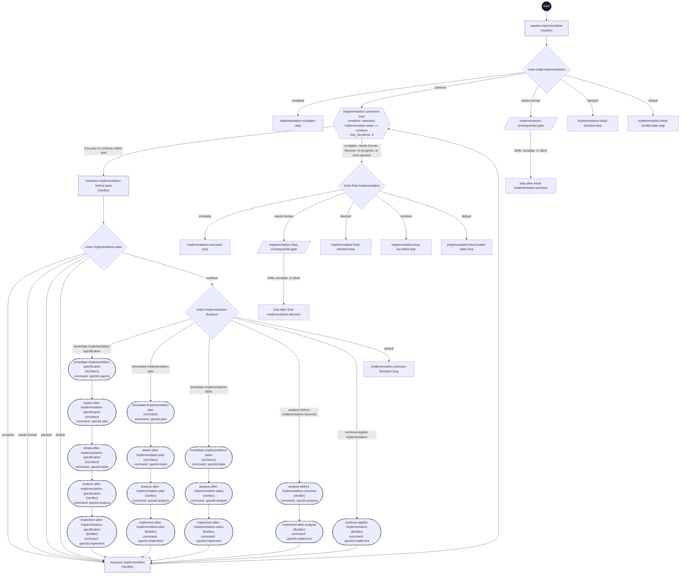

# Implement workflow flowchart

This diagram maps every step ID in [workflow.yml](./workflow.yml) to its execution path. Each node shows its step ID, its assigned agent in parentheses when present, and its command when present.

The dark Start circle marks workflow entry. Rectangles are `prompt` steps, diamonds are `switch` steps, the hexagon is the `do-while` step, parallelograms are `gate` steps, and rounded nodes are command steps. A dashed outline marks `flow_kit.delegated: true`. The correction loop permits at most five passes in one invocation.

The initial assessment can stop before correction. Within the loop, a `complete`, `needs-human`, `blocked`, or default result from `route-implementation-pass` skips correction and reaches `reassess-implementation`, as the empty YAML branches specify. A selected correction route reconciles the smallest affected artifact path and runs fresh analysis before implementation where tasks changed. The loop stops on a fresh complete or blocked result, a consequential decision, no progress, or the five-pass cap. Converge remains a separately invoked workflow.
