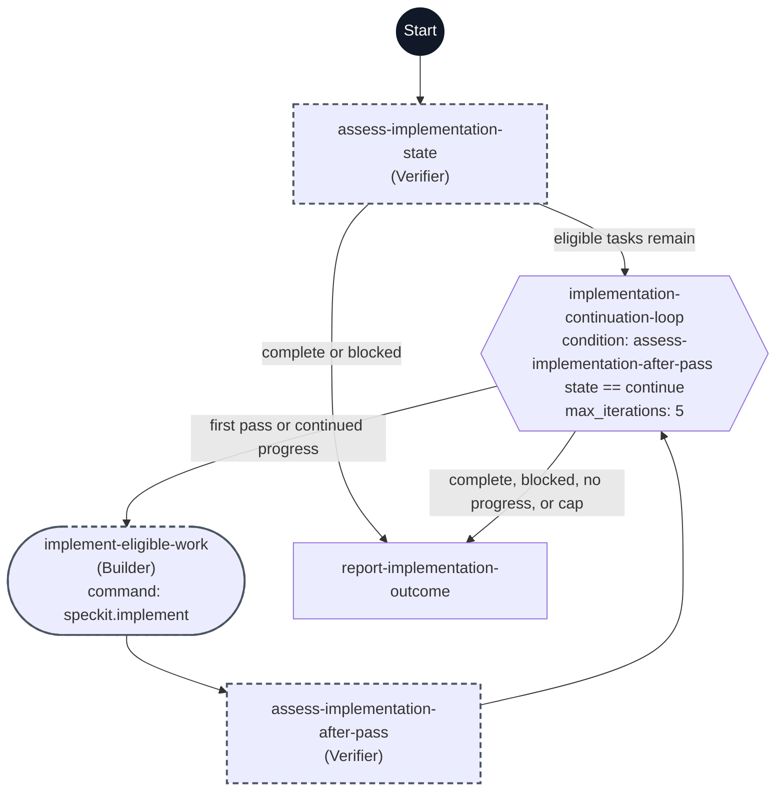

# Implement workflow flowchart

This diagram maps every step ID in [workflow.yml](./workflow.yml) to its execution path. Each node shows its step ID, its assigned agent in parentheses when present, and its command when present.

The dark Start circle marks workflow entry. The hexagon is a `do-while` step, the rounded node is a command step, and rectangles are `prompt` steps. A dashed outline marks `flow_kit.delegated: true`.

The initial assessment records unfinished tasks before any implementation session. Each pass runs the existing implementation skill and checks current task and validation evidence against that baseline. Another pass starts only when eligible tasks remain and progress is verified. The workflow stops for completion, operator input, a concrete blocker, no progress, or the five-pass safety cap; Converge remains a separate operator invocation.
