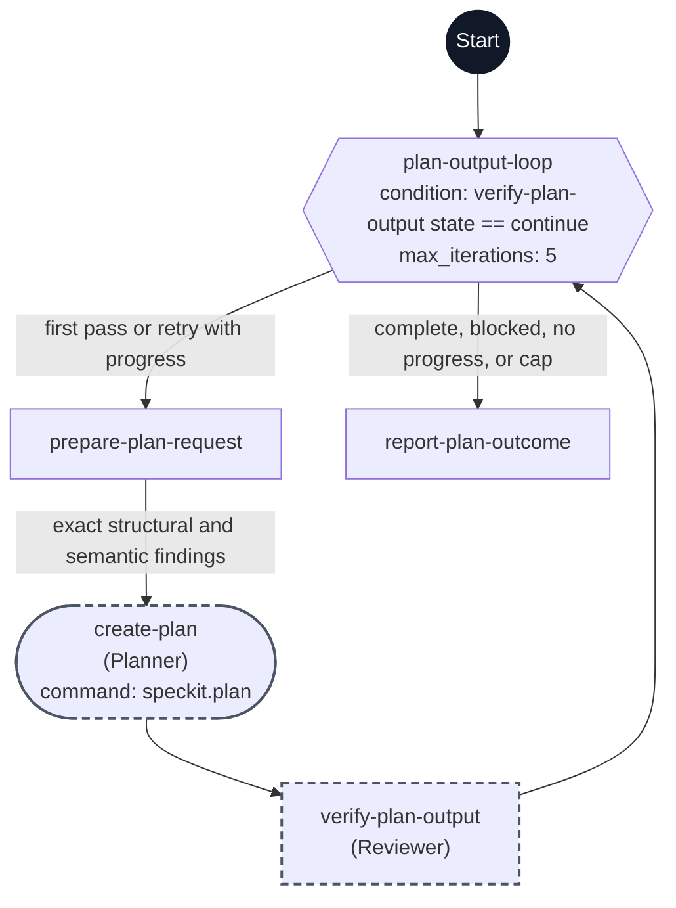

# Plan workflow flowchart

This diagram maps every step ID in [workflow.yml](./workflow.yml) to its execution path. Each node shows its exact step ID, its assigned agent in parentheses when present, and its command when present.

The dark Start circle marks workflow entry. The hexagon is a `do-while` step, rectangles are `prompt` steps, and the rounded node is a command step. A dashed outline marks `flow_kit.delegated: true`.

The first request records missing outputs as a progress baseline. Each retry feeds the exact missing files or placeholder sections from the latest verification into the planning skill while preserving completed design. Reviewer checks plan content against the approved specification, including tradeoffs, risks, and validation. Exact findings return through the existing planning loop. Another pass requires verified gap resolution. Operator input, blockers, no progress, or the five-pass safety limit stop the loop; Tasks remains a separate invocation.
