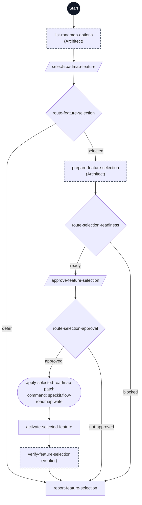

# Select Active Feature flowchart

This diagram maps every step ID in [workflow.yml](./workflow.yml) to its execution path. The dark Start circle marks entry; rectangles are prompts, diamonds are switches, parallelograms are human gates, and rounded nodes are commands. Dashed outlines indicate delegated steps.

Readiness uses ready or blocked, with required human input recorded as a blocker. Only approval takes the mutation branch; amendment and deferral share the not-approved exit and remain visible in the outcome. Dependency questions keep the selection gate pending until an explicit choice or defer. Only the approved roadmap/pointer proposal reaches mutation. Activation updates only .specify/feature.json; the target may not exist, and existing spec content is preserved. The final verification checks pointer and roadmap agreement. No specification, directory, or branch is created; Specify requires separate invocation. Failures after a roadmap write preserve and report the partial state.
