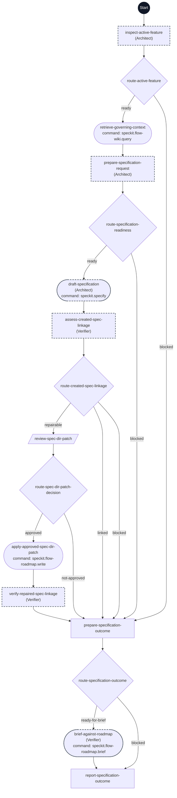

# Author Active Specification flowchart

This diagram maps every step ID in [workflow.yml](./workflow.yml) to its execution path. The dark Start circle marks entry; rectangles are prompts, diamonds are switches, parallelograms are human gates, and rounded nodes are commands. Dashed outlines indicate delegated steps.

In route-created-spec-linkage, linked and blocked reach the same outcome step but retain different evidence: only linked or a freshly verified approved repair can permit the brief. Conflicts, ambiguity, and required human input are blocked reasons. This workflow consumes the active .specify/feature.json pointer and unique roadmap mapping; it does not select a feature. A reserved target can be absent until authoring. The core command receives explicit SPECIFY_FEATURE_DIRECTORY and must preserve that identity. Verified initial linkage or an exactly approved repair with fresh verification reaches one brief. Missing context, ambiguity, target drift, deferred repair, or failed commands skip the brief or stop before further mutation. Clarify and Plan remain separately invoked.
