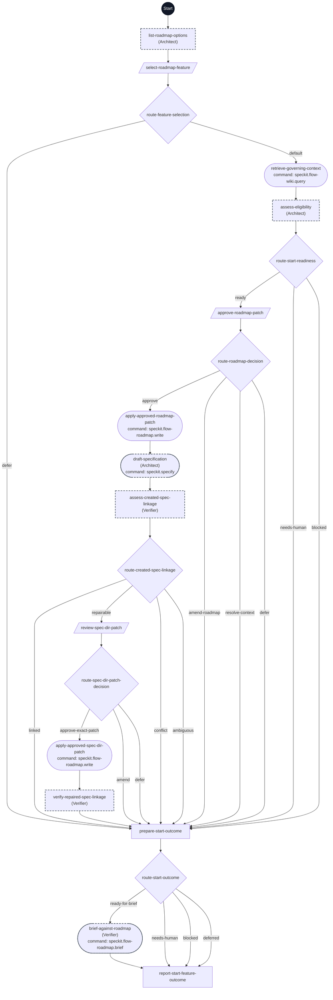

# Start Feature workflow flowchart

This diagram maps every step ID in [workflow.yml](./workflow.yml) to its execution path. Each node shows its exact step ID, assigned agent in parentheses when present, and command when present.

The dark Start circle marks workflow entry. Rectangles are prompt steps, diamonds are switch steps, parallelograms are human gates, and rounded nodes are command steps. Dashed outlines mark delegated steps.

The first step displays available roadmap entries, blocked unfinished work, simple dependency chains, immediate unlock counts, and distinct downstream dependents. The selection gate waits for one exact entry or defer; an optional feature request never selects automatically. Dynamic gate choices come from the completed inventory. No safe candidates means only defer is offered.

Only an explicit selection reaches governing context retrieval and eligibility assessment. Only a ready result reaches exact roadmap patch approval. Both already-linked and successfully-repaired paths join at `prepare-start-outcome`; a repair requires exact patch approval and fresh linkage verification. Deferral, missing context, conflicting or ambiguous linkage, or an unsuccessful recheck skips the shared brief. One final report presents successful artifacts or the exact stop reason. No next workflow is invoked. Invalid choices, missing outputs, and command errors stop before further mutation under controller rules.
