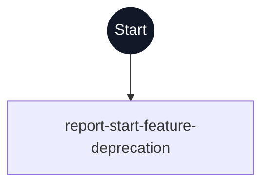

# Start Feature (Deprecated) flowchart

This diagram maps every step ID in [workflow.yml](./workflow.yml) to its execution path. The dark Start circle marks entry; rectangles are prompts, diamonds are switches, parallelograms are human gates, and rounded nodes are commands. Dashed outlines indicate delegated steps.

This combined workflow is deprecated. Its only step reports the replacement workflows and stops without mutation or agent dispatch. Select Feature and Specify must each be invoked separately; this workflow never launches them.
