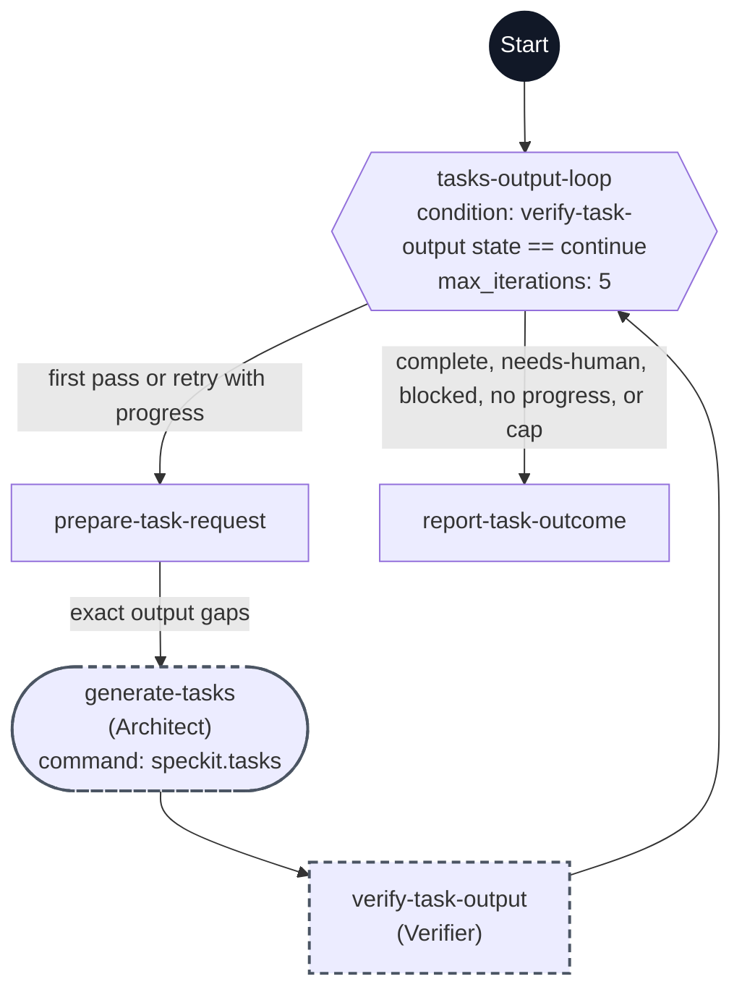

# Tasks workflow flowchart

This diagram maps every step ID in [workflow.yml](./workflow.yml) to its execution path. Each node shows its exact step ID, its assigned agent in parentheses when present, and its command when present.

The dark Start circle marks workflow entry. The hexagon is a `do-while` step, rectangles are `prompt` steps, and the rounded node is a command step. A dashed outline marks `flow_kit.delegated: true`.

The first request records output and coverage gaps as a progress baseline. Each retry feeds the exact remaining gaps into the task generation skill while preserving task IDs, completion markers, and reviewed design. Verification checks that the task plan is fully generated; unchecked implementation tasks are expected. Another pass requires verified gap resolution. Operator input, blockers, no progress, or the five-pass safety limit stop the loop. Task review, Analyze, and implementation remain separate operator actions.
