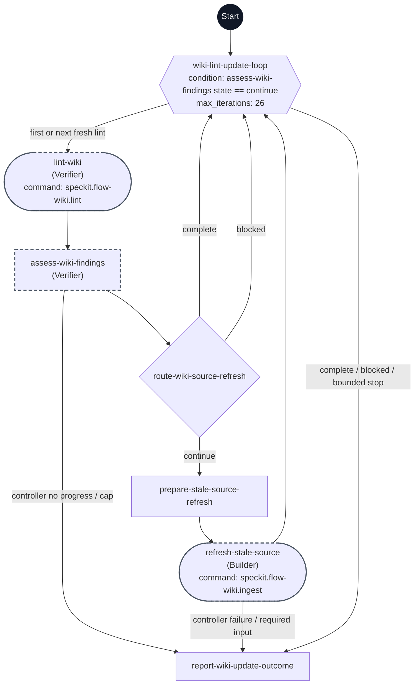

# Wiki lint/update workflow flowchart

This diagram maps every step ID in [workflow.yml](./workflow.yml). The dark Start circle marks entry; rectangles are prompts, diamonds are switches, the hexagon is the bounded loop, and rounded nodes are commands. Dashed outlines mark delegated steps.

Every pass starts with lint. The first assessment establishes the finding baseline; later assessments must prove a prior finding resolved before another source refresh. Twenty-six checks permit 25 single-source refreshes and a final confirmation. The controller validates evidence, progress, and the cap before executing the correction branch; the explicit controller stop edges supplement the YAML branch joins.

All lint findings remain visible. Safe source-backed stale findings map from affected page citations to registered source identities, deduplicating shared sources. One authorized source is re-ingested per pass. Independent contradictions and other non-stale issues do not prevent unrelated safe refreshes, but no conflicted claim is silently overwritten. Age-only warnings, unavailable or unauthorized sources, unsupported repairs, and scope or authority decisions remain unresolved and are reported. A clean outcome requires the latest lint to have no findings; otherwise the report lists remaining issues and safe resumption actions. This workflow maintains wiki content and reports its findings.
